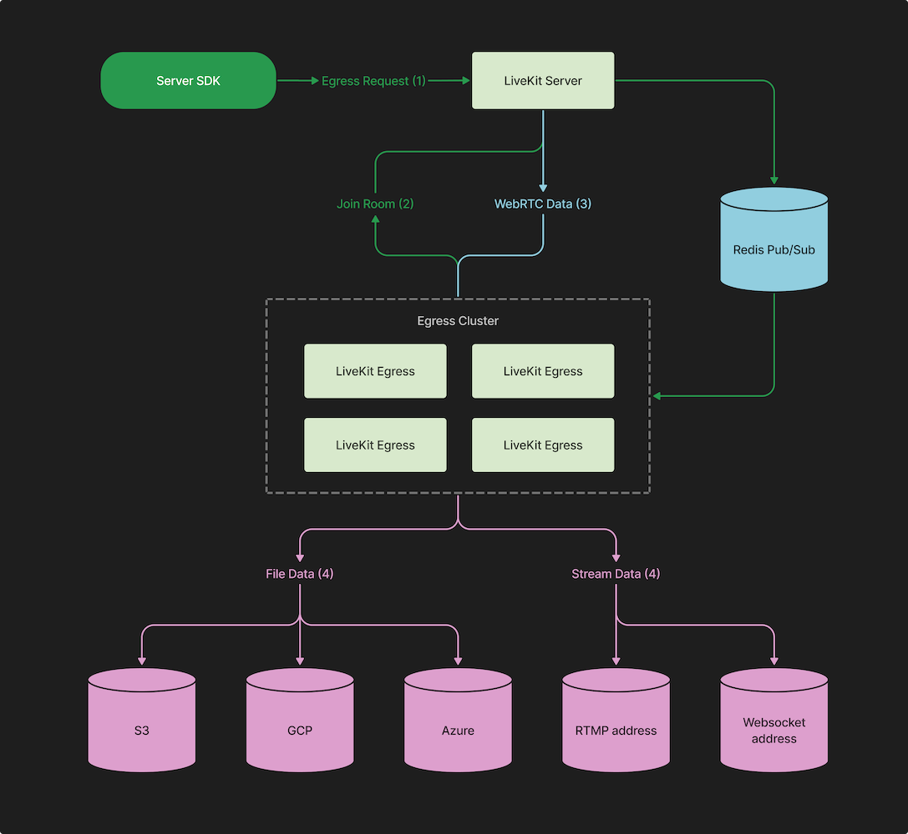

# LiveKit Egress

WebRTC is fantastic for last-mile media delivery, but interoperability with other services can be challenging. 
An application may want to do things like store a session for future playback, relay a stream to a CDN, or process a track through a transcription service – workflows where media travels through a different system or protocol.
LiveKit Egress is the solution to these interoperability challenges. It provides a consistent set of APIs that gives you 
universal export of your LiveKit sessions and tracks. 

## Capabilities

1. **Room composite** for exporting an entire room.
2. **Track composite** for exporting synchronized tracks of a single participant.
3. **Track egress** for exporting individual tracks.

Depending on your request type, the egress service will either launch a web template in Chrome and connect to the room 
(room composite requests), or it will use the sdk directly (track and track composite requests).
Irrespective of method used, when moving between protocols, containers or encodings, LiveKit's egress service will automatically transcode streams for you using GStreamer.

## Supported Output

| Egress Type     | MP4 File | OGG File | IVF File | Rtmp(s) Stream | Websocket Stream |
|-----------------|----------|----------|----------|----------------|------------------|
| Room Composite  | ✅        | ✅        |          | ✅              |                  |
| Track Composite | ✅        | ✅        |          | ✅              |                  |
| Track           | ✅        | ✅        | ✅        |                | ✅                |

Files can be uploaded to any S3 compatible storage, Azure, or GCP.

## Architecture



The overriding design goal of the egress system was to keep load off the SFU. Under no circumstances could we impact real-time audio and video performance or quality.

API interactions take place with your LiveKit Server, via `EgressService`.
Each Egress instance is a worker that observes Redis for incoming requests.
A worker may decide to fulfill a request based on its current load. For example, track egress doesn’t involve transcoding and is consequently lighter-weight, whereas room composite runs a full Chrome instance. Granting each worker agency over request fulfillment provides the cluster with flexibility over varying load and queue depth.


## API

All RPC definitions and options can be found [here](https://github.com/livekit/protocol/blob/main/livekit_egress.proto).  

The Egress API exists within our server sdks ([Go Egress Client](https://github.com/livekit/server-sdk-go/blob/main/egressclient.go) 
and [JS Egress Client](https://github.com/livekit/server-sdk-js/blob/main/src/EgressClient.ts)), and our
[cli](https://github.com/livekit/livekit-cli/blob/main/cmd/livekit-cli/egress.go) can be used to submit requests manually.  
The API is part of LiveKit Server, which uses redis to communicate with the Egress service.

See our [docs](https://docs.livekit.io/guides/egress) for code examples.

### StartRoomCompositeEgress

Export an entire room's video and/or audio using a web layout rendered by Chrome. Always transcoded.

Example use case: recording a meeting for team members to watch later.

The `File.Output` field can be left empty if one of `s3`, `azure`, or `gcp` is supplied with your config (see [below](#config)).
The `File.Filepath` field can be left empty, and a unique filename will be generated based on the date and room name.

Built-in layouts include `speaker-dark`, `speaker-light`, `grid-dark`, and `grid-light`.  
To create your own web templates, see [Egress Template SDK](https://github.com/livekit/egress/tree/main/template-sdk).

Egress will end when the room is closed or a StopEgress request is sent.

### StartTrackCompositeEgress

Sync and export up to one audio and one video track. Avoids transcoding when possible.

Example use case: exporting audio+video from many cameras at once during a production, for use in additional post-production.

Egress will end when the participant disconnects or stops publishing, or a StopEgress request is sent.

### StartTrackEgress

Export individual tracks directly. Video tracks are not transcoded or processed, and audio tracks are decoded.

You can either export the file to cloud storage, or stream it via WebSocket.

Egress will end when the track is unpublished or a StopEgress request is sent.

#### Websocket stream

Websocket streaming is only available for audio tracks. The tracks will be exported as raw PCM data (`Content-Type` audio/x-raw).

When a `TrackEgressRequest` is started with a websocket URL, we'll initiate a WebSocket request to the desired URL.

This gives you a way of receiving a real-time stream of media from LiveKit rooms. It's helpful for when additional
processing is desired on the media streams. For example, you could stream out audio tracks and send them to a real-time
transcription service.

We'll send a combination of binary and text frames. Binary frames would contain audio or video data, in the 
encoding specified by `Content-Type`. The text frames will contain end user events on the tracks. For example: if the
track was muted, you will receive the following:

```json
{ "muted": true }
```

And when unmuted:

```json
{ "muted": false }
```

The WebSocket connection will terminate when the track is unpublished (or if the participant leaves the room).

### UpdateLayout

Used to change the web layout on an active RoomCompositeEgress.

### UpdateStream

Used to add or remove stream urls from an active RoomComposite or TrackComposite stream.

### ListEgress

Used to list active egress. Does not include completed egress.

### StopEgress

Stops an active egress.

## Deployment

See our [docs](https://docs.livekit.io/deploy/egress) for more information on deploying an egress cluster.

### Config

The Egress service takes a yaml config file:

```yaml
# required fields
api_key: livekit server api key. LIVEKIT_API_KEY env can be used instead
api_secret: livekit server api secret. LIVEKIT_API_SECRET env can be used instead
ws_url: livekit server websocket url. LIVEKIT_WS_URL can be used instead
redis:
  address: must be the same redis address used by your livekit server
  username: redis username
  password: redis password
  db: redis db

# optional fields
health_port: if used, will open an http port for health checks
prometheus_port: port used to collect prometheus metrics. Used for autoscaling
log_level: debug, info, warn, or error (default info)
template_base: can be used to host custom templates (default https://egress-composite.livekit.io)
insecure: can be used to connect to an insecure websocket (default false)

# file upload config - only one of the following. Can be overridden 
s3:
  access_key: AWS_ACCESS_KEY_ID env can be used instead
  secret: AWS_SECRET_ACCESS_KEY env can be used instead
  region: AWS_DEFAULT_REGION env can be used instead
  endpoint: optional custom endpoint
  bucket: bucket to upload files to
azure:
  account_name: AZURE_STORAGE_ACCOUNT env can be used instead
  account_key: AZURE_STORAGE_KEY env can be used instead
  container_name: container to upload files to
gcp:
  credentials_json: GOOGLE_APPLICATION_CREDENTIALS env can be used instead
  bucket: bucket to upload files to
```

The config file can be added to a mounted volume with its location passed in the EGRESS_CONFIG_FILE env var, or its body can be passed in the EGRESS_CONFIG_BODY env var.

### Running locally

These changes are **not** recommended for a production setup.

To run against a local livekit server, you'll need to do the following:
* open `/usr/local/etc/redis.conf` and comment out the line that says `bind 127.0.0.1`
* change `protected-mode yes` to `protected-mode no` in the same file
* find your IP as seen by docker
  * `ws_url` needs to be set using the IP as Docker sees it
  * on linux, this should be `172.17.0.1`
  * on mac or windows, run `docker run -it --rm alpine nslookup host.docker.internal` and you should see something like
    `Name:	host.docker.internal
    Address: 192.168.65.2`

These changes allow the service to connect to your local redis instance from inside the docker container.

Create a directory to mount. In this example, we will use `~/egress-test`.

Create a config.yaml in the above directory.
* `redis` and `ws_url` should use the above IP instead of `localhost`
* `insecure` should be set to true

```yaml
log_level: debug
api_key: your-api-key
api_secret: your-api-secret
ws_url: ws://192.168.65.2:7880
insecure: true
redis:
  address: 192.168.65.2:6379
```

Then to run the service:
```shell
docker run --rm \
    -e EGRESS_CONFIG_FILE=/out/config.yaml \
    -v ~/egress-test:/out \
    livekit/egress
```

You can then use our [cli](https://github.com/livekit/livekit-cli) to submit egress requests to your server.

## FAQ

### I get a `"no response from egress service"` error when sending a request

* Your livekit server cannot an egress instance through redis. Make sure they are both able to reach the same redis db.
* Each instance currently only accepts one RoomCompositeRequest at a time - if it's already in use, 
* you'll need to deploy more instances or set up autoscaling.

### I get a different error when sending a request

* Make sure your egress, livekit, server-sdk-go, server-sdk-js, and livekit-cli repos and deployments are all up to date.

### I'm getting a broken (0 byte) mp4 file

* This is caused by the process being killed - GStreamer needs to be properly shut down to close the file. 
* Make sure your instance has enough CPU and memory, and is being stopped correctly.

### I'm seeing GStreamer warnings/errors. Is this normal?

* `GStreamer-CRITICAL **: 20:22:13.875: gst_mini_object_unref: assertion 'GST_MINI_OBJECT_REFCOUNT_VALUE (mini_object) > 0' failed`
  * Occurs during audio-only egress - this is a gst bug, and is safe to ignore.
* `WARN flvmux ... Got backwards dts! (0:01:10.379000000 < 0:01:10.457000000)`
  * Occurs when streaming to rtmp - safe to ignore. These warnings occur due to live sources being used for the flvmux. 
    The dts difference should be small (under 150ms).

### Can I run this without docker?

* It's possible, but not recommended. To do so, you would need gstreamer and all the plugins installed, along with xvfb,
  and have a pulseaudio server running.

## Testing and Development

Running `mage test` will run the Room Composite tests on your machine, and will dump the resulting files into egress/test/output.

To run these tests against your own LiveKit rooms, a deployed LiveKit server with a secure websocket url is required.
First, create `egress/test/config.yaml`:

```yaml
log_level: debug
api_key: your-api-key
api_secret: your-api-secret
ws_url: wss://your-livekit-url.com
room_name: your-room
room: true
track_composite: true
track: true
file: true
stream: true
muting: false
gst_debug: 1
```

Join a room using https://example.livekit.io or your own client, then run `mage integration test/config.yaml`.  
This will test recording different file types, output settings, and streams against your room.
